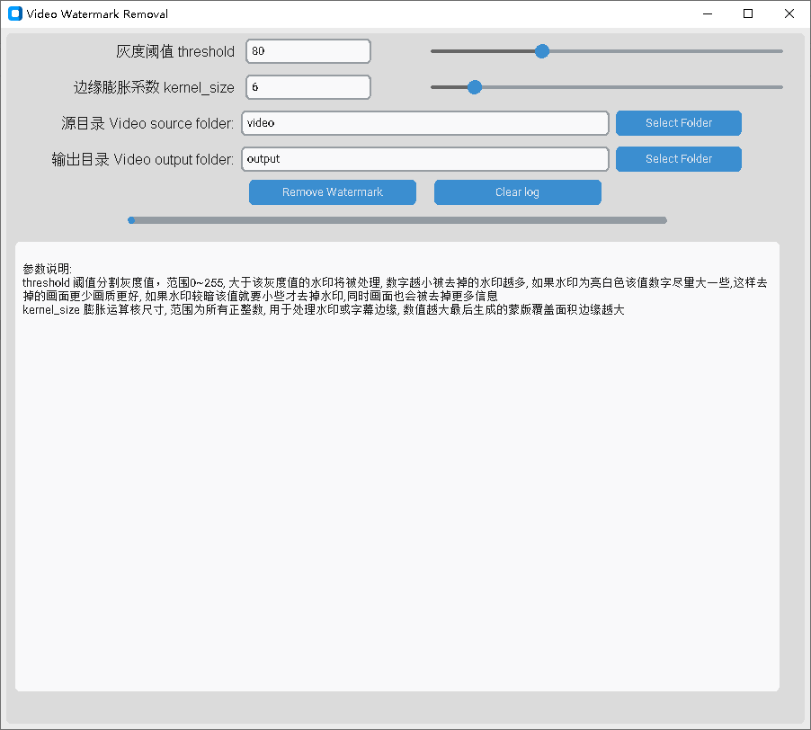

# VideoWatermarkRemover
Removing fixed-position watermarks and subtitles from a video by manually selecting the areas.

通过手动框选区域去除视频中位置固定的水印和字幕.

## 项目介绍
GUI for [WatermarkRemover](https://github.com/lxulxu/WatermarkRemover)



## Download
Visit the **[GitHub Releases](https://github.com/jinwyp/VideoWatermarkerRemover/releases)** to download the latest version or any previous release.


## How to Use 如何使用

### 1. Installing dependencies. 安装依赖：
  `pip install -r requirements.txt`

### 2. Run 运行程序
待处理视频放在`video`文件夹下，所有视频尺寸须保持一致，鼠标框选水印或字幕对应区域后按**SPACE**或**ENTER**键

Place the videos to be processed in the `video` folder. Ensure that all videos have the same dimensions. Use the mouse to select the area corresponding to the watermark or subtitles, then press the **SPACE** or **ENTER** key.


- **Function call example 函数调用示例**
```python
# Remove Watermark 去除视频水印 
remover = WatermarkRemover(threshold=80, kernel_size=5)
remover.remove_video_watermark(video_path)

# Remove subtitle 去除视频字幕
remover = WatermarkRemover(threshold=80, kernel_size=10)
remover.remove_video_subtitle(video_path)
```
| Param | Description |
| - | - |
| threshold | 阈值分割灰度值，范围0~255，根据水印灰度值自行调整 |
| kernel_size | 膨胀运算核尺寸，范围所有正整数，用于处理水印或字幕边缘 |

- **Output file 输出**
Removing watermarks. 去除水印：`output/[文件名] + [_no_watermark].mp4`
Removing subtitle. 去除字幕：`output/[文件名] + [_no_sub].mp4`


## 流程图
  - **去除水印**
    ```mermaid
    graph LR
    ROI[框选水印] --> SINGLE_MASK[截取若干帧生成对应模板]
    SINGLE_MASK -->|逻辑与运算|MASK[最终水印模板]
    MASK --> FRAME[读取视频]
    FRAME --> AUDIO[抽取音频] 
    FRAME --> INPAINT[TELEA算法逐帧修复]
    INPAINT --> VIDEO[逐帧写入视频]
    AUDIO --> OUTPUT
    VIDEO --> OUTPUT[合并封装输出视频]
    ```
  - **去除字幕**
    ```mermaid
    graph LR
    ROI[框选字幕] --> FRAME[读取视频]
    FRAME --> MASK[生成单帧图像模板]
    FRAME --> AUDIO[抽取音频]
    MASK --> INPAINT[TELEA算法逐帧修复]
    INPAINT --> VIDEO[逐帧写入视频]
    VIDEO --> OUTPUT[合并封装输出视频]
    AUDIO --> OUTPUT
    ```